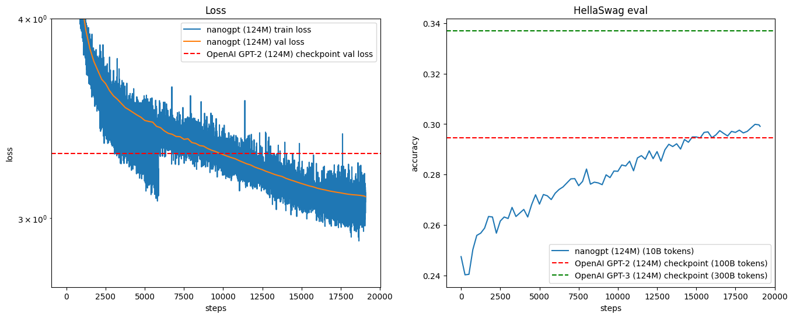

# nano-gpt-124m-

Implementation of a GPT-style model from scratch, following [Andrej Karpathy’s nanoGPT tutorial](https://github.com/karpathy/build-nanogpt).

## 📌 About
This repo is my project where I reimplemented the GPT-2 (124M parameter) model based on Karpathy’s tutorial.
I may extend this with my own experiments, modifications, and notes.

## 📈 Training Results

I trained the 124M parameter model on a 10-billion token subset of the FineWeb dataset. The plot below shows the training and validation loss, as well as the HellaSwag evaluation accuracy, over ~19,000 training steps. The training took around 10 hours on 2 A100-80GB GPUs with distributed training.

### Key Observations:

* **Loss (Left Plot):** The validation loss (orange) tracks the OpenAI GPT-2 checkpoint (red dashed line) very closely, indicating a successful replication of the model.
* **HellaSwag Accuracy (Right Plot):** The model's accuracy on the HellaSwag benchmark (blue line) steadily increases throughout training. It successfully surpasses the baseline score of the original OpenAI GPT-2 (100B tokens) and begins to approach the performance of the OpenAI GPT-3 (300B tokens) checkpoint (with longer training).